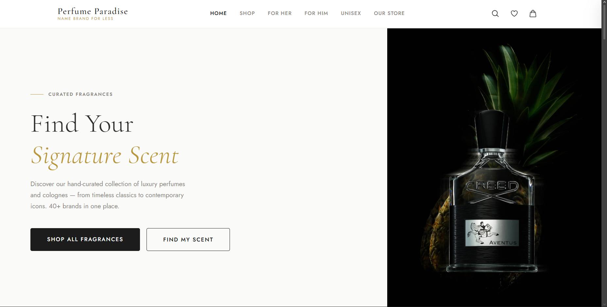
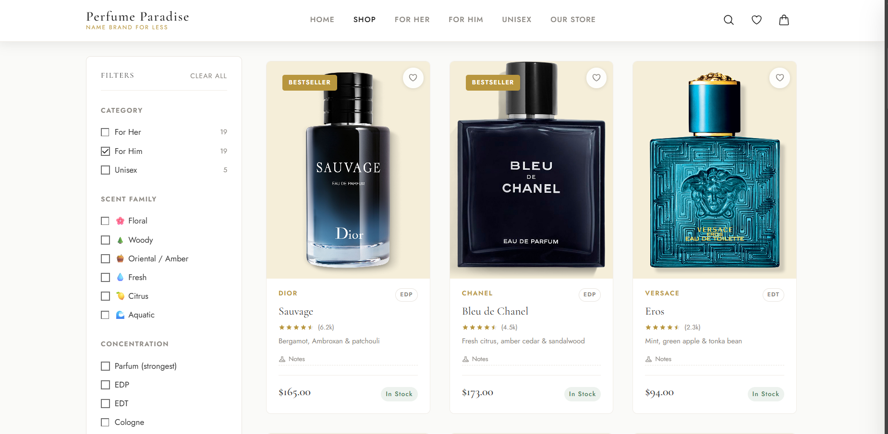

# Perfume Paradise 🌸

**Luxury fragrances for every occasion — Name Brand for Less**

A fully custom e-commerce website built for Perfume Paradise, a fragrance retail brand with a physical storefront at Mall St. Matthews in Louisville, KY. Designed and developed from scratch with a focus on brand identity, clean UX, and a complete shopping experience.

---

### Homepage

### Shop / Product Catalog

---

## What I Built

- **Multi-page storefront** — Home, Shop (with category filtering), Product Detail, Checkout, Order Confirmation, and Store Policy pages
- **Product catalog** — Dynamically rendered product cards with gender-based filtering (For Her, For Him, Unisex), search, and sorting
- **Product detail page** — Size selector, quantity picker, image gallery, and add-to-cart flow
- **Shopping cart** — Persistent cart with localStorage, live item count badge, slide-out drawer
- **Checkout flow** — Form validation, order summary, and Clover POS integration for in-person payment processing
- **Responsive design** — Mobile-first layout that works across all screen sizes
- **Brand identity** — Custom design system built around the brand's luxury aesthetic (dark gold `#b8963e`, off-white cream tones, serif typography)

## Tech Stack

| Layer | Technology |
|---|---|
| Structure | HTML5 (semantic) |
| Styling | Vanilla CSS (custom design system, CSS variables) |
| Interactivity | Vanilla JavaScript (ES6+) |
| Payments | Clover POS API |
| Hosting | Static site (no backend required) |

## Pages

| File | Description |
|---|---|
| `index.html` | Homepage — hero, featured categories, brand story |
| `products.html` | Full product catalog with filtering and search |
| `product.html` | Individual product detail with size/qty selection |
| `checkout.html` | Checkout form with order summary |
| `confirmation.html` | Order confirmation page |
| `policy.html` | Store info, return policy, contact |

## Note on Source Code

This is a client project for an active retail business. To protect the store's operations and security, the following are intentionally excluded from this public repository:

- **`js/data.js`** — Product catalog data (pricing, inventory, listings)
- **`js/cart.js`** — Cart and order management logic
- **`js/clover-api.js`** — Payment processing integration (Clover POS credentials and API calls)
- **`js/main.js`** — Site-wide UI and interaction logic
- **All inline JavaScript** — Page-level business logic has been removed from the HTML files

The HTML structure and CSS design system are available here to demonstrate the layout architecture and front-end craft. Full source is available upon request for verified opportunities.

---

**Built by [Karim Abdelfattah](https://github.com/Karimabdelfattah7)**
